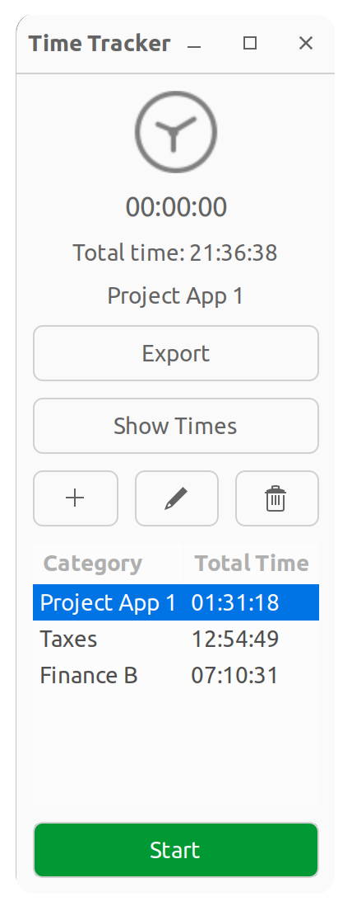

# Simple Time Tracker

A simple time tracking application built with Python and GTK.

## Description
Time Tracker is a desktop application that allows users to track the time spent on various tasks or categories. Users can create, edit, and delete categories, as well as start and stop a timer to log the time spent on a specific category. The app displays the total time spent for each category and the overall total time spent on all tasks.

## Features
* Create, edit, and delete categories.
* Start and stop a timer to track time spent on a specific category.
* View total time spent for each category and overall total time.
* Export category data to a text file.
* Support for negative times and customized total time for categories.
* Clean and easy-to-use interface built with Python and GTK.

## Dependencies
* Python 3
* Gtk 3.0
* sqlite3
* OS
* configparser

## Installation
1. Make sure you have Python 3.x installed on your system.
2. Install the required dependencies: 
```bash
pip install pygobject
```
3. Clone the repository:
```bash
git clone https://github.com/randree/simple-time-tracker
```
4. Navigate to the project directory:
```bash
cd time-tracker
```
5. Run the application:
```bash
python3 time-tracker.py
```
## Usage
1. Add a new category using the "Add Category" button.
2. Select a category from the dropdown menu.
3. Start the timer by clicking the "Start" button. The button will change to "Stop" while the timer is running.
4. Stop the timer by clicking the "Stop" button. The elapsed time will be added to the selected category.
5. Edit a category's name or total time by clicking the "Edit Category" button.
6. Delete a category by clicking the "Delete Category" button.
7. Export category data to a text file by clicking the "Export" button.

## License
This project is licensed under the MIT License. See the LICENSE file for more information.
